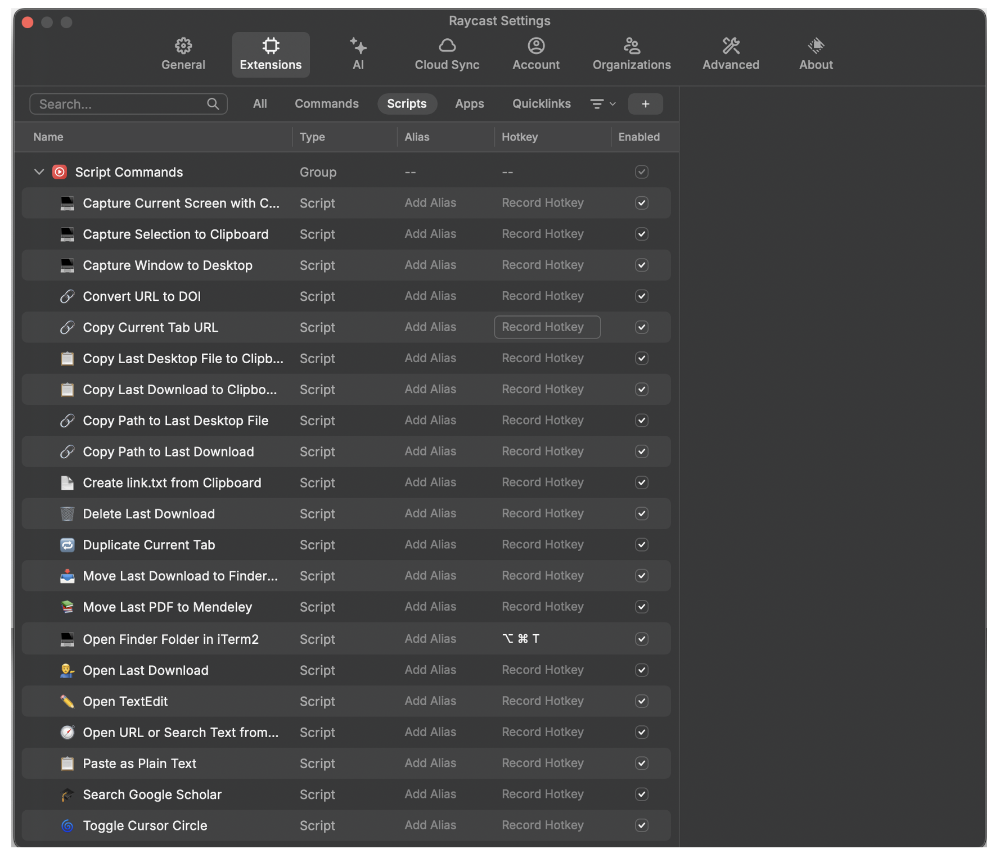

# raycast_scripts

## Scripts

| Script | Description |
|--------|-------------|
| `capture-fullscreen-to-desktop.sh` | Captures the screen containing the cursor (with cursor visible) and saves it to Desktop. |
| `capture-selection-to-clipboard.sh` | Screenshots a user-selected area and copies it to the clipboard. |
| `capture-window-to-desktop.sh` | Screenshots a user-selected window and saves it to Desktop. |
| `copy-current-url.applescript` | Copies the URL of the active tab in Safari or Chrome. |
| `copy-last-desktop-path.swift` | Copies the absolute path of the most recently added Desktop file to the clipboard. |
| `copy-last-download-path.swift` | Copies the absolute path of the most recently downloaded file to the clipboard. |
| `create-link-txt.applescript` | Creates `link.txt` in the current Finder folder, writing the clipboard URL into it. |
| `delete-last-download.swift` | Deletes the most recently downloaded file after a confirmation dialog. |
| `duplicate-tab.applescript` | Opens the current browser tab's URL in a new tab (Safari or Chrome). |
| `move-last-pdf-to-mendeley.swift` | Moves the most recently downloaded PDF to the Mendeley Desktop Downloaded folder. |
| `open-finder-folder-in-iterm.sh` | Opens the frontmost Finder window's directory in a new iTerm2 window. |
| `open-last-download.swift` | Opens the most recently downloaded file with its default application. |
| `open-textedit.applescript` | Opens a new TextEdit document pre-filled with the clipboard content. |
| `safari-clipboard-url.applescript` | Opens a clipboard URL (or Google-searches clipboard text) in a new Safari tab. |
| `toggle-circle-cursor.sh` | Toggles a circle drawn around the cursor, useful for screen recordings and presentations. |
| `url-to-doi.sh` | Extracts a DOI from a clipboard URL (scrapes metadata or parses the URL) and copies it. |
